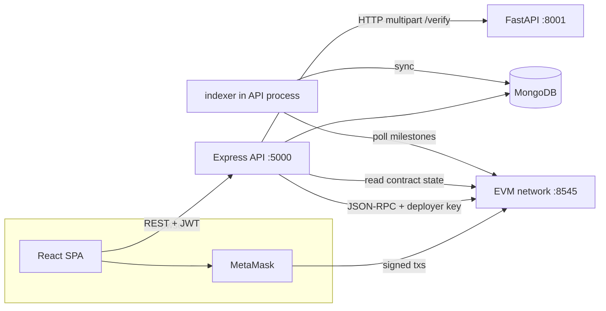

# MedTrustFund — Interview Preparation README

**MedTrustFund** is a full-stack **decentralized medical crowdfunding** platform that combines **AI-assisted document verification**, **JWT-based RBAC**, **MongoDB persistence**, and an **Ethereum escrow smart contract** so donors can contribute with clearer transparency and milestone-gated fund movement.

This document is written for **technical interviews**: it maps **what the product does**, **how the code is organized**, **how services talk to each other**, and **how to run everything locally**. For day-to-day setup tips, see [`SETUP.md`](./SETUP.md). For requirements-level depth (SRS-style), see [`MedTrustFund_Documentation.md`](./MedTrustFund_Documentation.md).

---

## Table of contents

1. [Elevator pitch (30 seconds)](#elevator-pitch-30-seconds)
2. [Problem and solution](#problem-and-solution)
3. [Tech stack (as implemented)](#tech-stack-as-implemented)
4. [Repository layout](#repository-layout)
5. [System architecture](#system-architecture)
6. [End-to-end flows](#end-to-end-flows)
7. [Feature catalog](#feature-catalog)
8. [REST API surface](#rest-api-surface)
9. [Smart contract: `MedTrustFundEscrow`](#smart-contract-medtrustfundescrow)
10. [AI verification service](#ai-verification-service)
11. [Data model (MongoDB)](#data-model-mongodb)
12. [Security, privacy, and compliance-oriented features](#security-privacy-and-compliance-oriented-features)
13. [Blockchain indexer](#blockchain-indexer)
14. [Run locally (detailed)](#run-locally-detailed)
15. [Tests and quality checks](#tests-and-quality-checks)
16. [Honest implementation notes for interviews](#honest-implementation-notes-for-interviews)
17. [Team and license](#team-and-license)

---

## Elevator pitch (30 seconds)

> Patients create campaigns and upload medical documents. A **Python FastAPI** service extracts text (OCR / PDF), runs **heuristic fraud signals**, and returns a **0–100 risk score** with a recommendation. The **Node/Express** API stores campaigns, donations, and audit logs in **MongoDB**, enforces **role-based access**, and can **deploy and interact** with a **Solidity escrow** using **ethers.js v6** and **Hardhat** artifacts. Donors connect **MetaMask** from a **React 19 + TypeScript + Vite** app; funds sit in contract escrow until **hospital-confirmed milestones** and **patient/admin-triggered releases** (see contract section for exact on-chain behavior).

---

## Problem and solution

| Pain in traditional crowdfunding | How this project approaches it |
|----------------------------------|--------------------------------|
| Weak or manual document checks | Automated pipeline: PDF/image text extraction, tampering heuristics, cross-document consistency, weighted risk score |
| Donors cannot see a structured risk signal | Risk breakdown + badges in the UI; thresholds drive auto vs escalated paths |
| Funds are not programmatically tied to milestones | Escrow contract: per-milestone amounts; `donate()` locks value on-chain; release is gated by `confirmMilestone` + `releaseMilestone` |
| Weak traceability for governance | `AuditLog` model with TTL aligned to a **5-year retention** policy; API rate limiting and security middleware on the backend |

---

## Tech stack (as implemented)

| Layer | Technologies | Notes |
|-------|----------------|-------|
| **Frontend** | React **19**, TypeScript **~5.9**, Vite **7**, React Router **6** | UI: **Chakra UI v3**, **Tailwind CSS v4**, **Framer Motion**, **TanStack Query**, **react-hook-form** + **Zod** |
| **Backend** | Node.js, **Express 4**, **Mongoose 8** | Auth: **JWT** (`jsonwebtoken`), passwords **bcryptjs**; HTTP hardening: **helmet**, **express-rate-limit**, **express-mongo-sanitize**, **xss-clean** |
| **Blockchain** | **Solidity 0.8.24**, **Hardhat 2**, **ethers.js v6** | Local RPC default `http://127.0.0.1:8545`; optional **Polygon Amoy** in `hardhat.config.js` |
| **AI service** | **Python**, **FastAPI**, **PyMuPDF (fitz)**, **Pillow**, **pytesseract** | Requires **Tesseract OCR** installed on the host OS for image OCR |
| **Storage** | MongoDB | Campaigns, users, donations, risk assessments, smart contract records, audit logs |
| **File uploads** | `multer` (backend), disk under configurable `UPLOAD_DIR` | Static `/uploads` route served by Express |

**Versions** are taken from `frontend/package.json`, `backend/package.json`, `hardhat/package.json`, and `ai-service/requirements.txt` in this repository.

---

## Repository layout

```
decentralizedCrowdFund/
├── frontend/                 # React + Vite SPA
│   └── src/
│       ├── pages/            # Route-level screens (campaigns, admin, milestones, etc.)
│       ├── components/       # Shared UI (Navbar, wallet button, uploaders, badges)
│       ├── contexts/         # Auth + theme
│       ├── services/api.ts   # Axios client (JWT header, 401 → login)
│       └── utils/web3.ts     # MetaMask helpers, wei/eth, network helpers
├── backend/
│   ├── server.js             # Express app, middleware, route mounting, indexer start
│   ├── routes/               # auth, campaigns, donations, milestones, admin
│   ├── models/               # Mongoose schemas
│   ├── middleware/auth.js    # JWT auth, RBAC, audit response hook
│   ├── utils/
│   │   ├── contractUtils.js  # Artifact load, deploy, on-chain calls
│   │   └── indexer.js        # Polls chain → syncs milestone state to MongoDB
│   └── services/             # Wallet-related helpers
├── hardhat/
│   ├── contracts/MedTrustFundEscrow.sol
│   ├── scripts/deploy.js     # Example deploy script (placeholder addresses)
│   └── hardhat.config.js     # solidity 0.8.24, hardhat + amoy networks
├── ai-service/
│   ├── main.py               # FastAPI app, /verify, /health
│   └── requirements.txt
├── uploads/                  # Uploaded documents (created at runtime; gitignored as appropriate)
├── .env.example              # Environment template (root; backend uses dotenv from cwd)
├── SETUP.md                  # Operational setup guide
├── MedTrustFund_Documentation.md  # SRS-style documentation
└── IMPLEMENTATION_SUMMARY.md # Changelog-style implementation notes
```

---

## System architecture

### Logical view



### Request path (typical campaign creation)

1. **Patient** submits campaign + files → **Express** (`multer`) persists files and metadata.
2. **Express** (or flow initiated from campaign route) calls **AI service** → risk JSON returned.
3. **Express** persists **Campaign**, **RiskAssessment**, document hashes, status transitions.
4. **Admin** approves / deploys contract → **ethers** deploys `MedTrustFundEscrow`, stores address + ABI (see `SmartContract` model).
5. **Donor** sends ETH via MetaMask to `donate()` → **Express** records **Donation** with tx hash.
6. **Hospital** confirms milestone on-chain → **Patient/Admin** calls `releaseMilestone` → DB updated; **indexer** also reconciles chain → DB.

---

## End-to-end flows

### A. Patient: register → create campaign

- Sign up with role **`patient`** (`POST /api/auth/signup`).
- Create campaign with up to **5** document files (`POST /api/campaigns`, `patient` only, multipart).
- Campaign schema supports document types: `identity`, `diagnosis`, `admission_letter`, `cost_estimate`, each with optional **SHA-256** hash for integrity.
- AI verification produces a **final risk score** and recommendation (`approve` vs `escalate`) used by the backend/UI.

### B. Admin: governance

- All `/api/admin/*` routes use **`authMiddleware` + `roleMiddleware(['admin'])`**.
- Review pending/high-risk campaigns, make approve/reject decisions, inspect audit logs, list deployed contracts, manage users.

### C. Donor: donate

- Browse public campaign routes (`GET /api/campaigns`, `GET /api/campaigns/:id`).
- Connect wallet in the frontend (`utils/web3.ts`, `WalletConnectButton`).
- Donation may be recorded via `POST /api/donations` and/or backend-assisted `POST /api/donations/:campaignId/donate-direct` (see route implementation for prerequisites such as contract deployment).

### D. Hospital + milestone release

- Hospital confirms: `POST /api/milestones/:campaignId/confirm` (hospital role).
- Release: `POST /api/milestones/:campaignId/release` (**patient** or **admin**).
- **Indexer** (`backend/utils/indexer.js`) periodically calls `getContractMilestones` and merges on-chain `confirmed` flags into `SmartContract` documents in MongoDB.

---

## Feature catalog

### By user role

| Role | Representative capabilities in this codebase |
|------|-----------------------------------------------|
| **Patient** | Create/update/delete own campaigns; view **My Campaigns**; trigger milestone **release** (with contract rules); profile |
| **Donor** | Donate (wallet + API recording); **My Donations**; refunds where implemented |
| **Hospital** | Confirm milestones; list hospital-scoped campaigns (`GET /api/milestones/hospital/my-campaigns`); hospital profile page |
| **Admin** | Dashboard metrics; pending review queues; campaign decisions; user admin CRUD; audit log views + export; deployed contract listing |

### Frontend routes (`frontend/src/App.tsx`)

| Path | Purpose |
|------|---------|
| `/`, `/login`, `/signup` | Marketing/home and auth |
| `/campaigns`, `/campaign/:id` | Public discovery and detail + donation UX |
| `/dashboard`, `/create-campaign` | Authenticated home flows |
| `/my-campaigns`, `/my-donations` | Patient/donor hubs |
| `/milestones` | Hospital milestone workflow |
| `/profile`, `/analytics`, `/hospital-profile` | Account and analytics-style pages |
| `/admin/dashboard`, `/admin/users`, `/admin/audit-logs`, `/admin/contracts` | Admin console sections |

> The app uses a lightweight **`ProtectedRoute`** wrapper: presence of `localStorage.token` gates private pages (no server-side render guard).

### Backend capabilities (cross-cutting)

- **Global audit hook**: `auditLogMiddleware` wraps `res.json` for authenticated users and persists `AuditLog` entries (best-effort `save()`).
- **Rate limiting**: `100` requests / **15 minutes** / IP on `/api/*`.
- **Static uploads**: `GET /uploads/...` for stored files.
- **Health**: `GET /api/health` returns Mongo connection state.

---

## REST API surface

Base URL (local): `http://localhost:5000`. JSON body unless noted. Bearer JWT: `Authorization: Bearer <token>`.

### Auth — `/api/auth`

| Method | Path | Access | Purpose |
|--------|------|--------|---------|
| POST | `/signup` | Public | Register |
| POST | `/login` | Public | Login → JWT |
| GET | `/profile` | Auth | Profile |
| PUT | `/profile` | Auth | Update profile |
| POST | `/verify-wallet` | Auth | Associate wallet |
| GET | `/users/:id` | Admin | Fetch user |

### Campaigns — `/api/campaigns`

| Method | Path | Access | Purpose |
|--------|------|--------|---------|
| POST | `/` | Patient | Create (+ file upload) |
| GET | `/` | Public | List |
| GET | `/:id` | Public | Detail |
| PUT | `/:id` | Patient, Admin | Update |
| DELETE | `/:id` | Auth (see route) | Delete |
| POST | `/:id/deploy-contract` | Admin | Deploy escrow from server signer |
| GET | `/:id/donations` | Public | Donations for campaign |
| POST | `/:id/admin-review` | Admin | Admin review actions |

### Donations — `/api/donations`

| Method | Path | Access | Purpose |
|--------|------|--------|---------|
| POST | `/` | Donor | Create donation record |
| GET | `/` | Auth | List (context depends on implementation) |
| GET | `/:id` | Auth | Donation detail |
| POST | `/:id/refund` | Auth | Refund flow |
| GET | `/campaign/:campaignId` | Public | By campaign |
| POST | `/:campaignId/donate-direct` | Donor | Backend-driven donation path |

### Milestones — `/api/milestones`

| Method | Path | Access | Purpose |
|--------|------|--------|---------|
| POST | `/:campaignId/confirm` | Hospital | Confirm milestone |
| POST | `/:campaignId/release` | Patient, Admin | Release funds for milestone |
| GET | `/:campaignId` | Public | Milestone snapshot |
| GET | `/hospital/my-campaigns` | Hospital | Scoped campaign list |

### Admin — `/api/admin` (all routes: **admin** only)

| Method | Path | Purpose |
|--------|------|---------|
| GET | `/dashboard` | Aggregate stats + recent audits |
| GET | `/campaigns/pending-review` | Queue |
| GET | `/campaigns/:id/review-details` | Detail for decisioning |
| POST | `/campaigns/:id/decision` | Approve/reject |
| GET | `/users` | User list |
| PUT | `/users/:id` | Update user |
| DELETE | `/users/:id` | Deactivate/delete (see handler) |
| GET | `/audit-logs` | Query logs |
| GET | `/audit-logs/export` | Export format for compliance workflows |
| GET | `/contracts` | List smart contract deployments |

---

## Smart contract: `MedTrustFundEscrow`

**File:** `hardhat/contracts/MedTrustFundEscrow.sol`  
**Compiler:** Solidity `^0.8.24` (configured in Hardhat as `0.8.24`)

### Roles (immutable after deploy)

| Field | Meaning in code |
|-------|-----------------|
| `owner` | `msg.sender` at deploy time — typically the **deployer account** (in this project, the backend’s `PRIVATE_KEY` wallet when deploying from `contractUtils.deployEscrowContract`) |
| `patient` | Constructor arg `_patient` — end recipient of released milestone funds |
| `hospital` | Constructor arg `_hospital` — **only** this address may call `confirmMilestone` |

### State

- `milestones[]`: each milestone has `description`, `amount` (wei), `confirmed`, `releasedAt`.
- `totalDonated`: incremented on each `donate()` payment.
- `isActive`: when `false`, `donate()` reverts.

### External functions

| Function | Who can call | Behavior |
|----------|--------------|----------|
| `donate()` | Anyone | Payable; requires `isActive`; increases `totalDonated`; emits `Donated` |
| `confirmMilestone(index)` | `hospital` | Sets `milestones[index].confirmed = true`; emits `MilestoneConfirmed` |
| `releaseMilestone(index)` | **`owner` OR `patient`** | Requires milestone confirmed, not already released, sufficient balance; **transfers `milestone.amount` wei to `patient`**; sets `releasedAt`; emits `FundsReleased` |
| `refund(donor, amount)` | **`owner` only** | Decrements `totalDonated` (guarded by `require`), transfers `amount` to `donor`; emits `Refunded` |
| `getMilestones()` | View | Returns full milestone array |

### Events

- `Donated(donor, amount)`
- `MilestoneConfirmed(index)`
- `FundsReleased(index, amount)`
- `Refunded(donor, amount)`

### Deployment (application path)

1. `npx hardhat compile` → artifact at `hardhat/artifacts/contracts/MedTrustFundEscrow.sol/MedTrustFundEscrow.json`.
2. Backend `loadContractArtifact()` reads ABI + bytecode.
3. `deployEscrowContract(patientAddress, hospitalAddress, milestones)` builds `ContractFactory` with **`PRIVATE_KEY`** signer on `RPC_URL`.
4. Deployment tx hash and address are persisted on the related **Campaign** / **SmartContract** documents (see routes in `campaigns.js`).

### Optional CLI deploy script

`hardhat/scripts/deploy.js` demonstrates `getContractFactory` + `deploy` with **placeholder** patient/hospital addresses and static milestone arrays — useful for manual testing; the **productized** path is the **admin API** deployment.

---

## AI verification service

**Entry:** `ai-service/main.py` (FastAPI)

### Endpoints

| Method | Path | Purpose |
|--------|------|---------|
| GET | `/health` | Liveness + version metadata |
| POST | `/verify` | Multipart upload of files + `hospital_verified` flag → structured risk result |

### Pipeline (conceptual stages)

1. **Ingest** files to `./uploads` under the AI service working directory.
2. **Text extraction**: PDF via **PyMuPDF**; images via **Tesseract** (`pytesseract`).
3. **Document typing**: keyword scoring into `identity`, `diagnosis`, `admission_letter`, `cost_estimate`, or `unknown`.
4. **Signals**:
   - **Tampering heuristics** (`check_image_tampering`): file size, missing EXIF, resolution/compression heuristics.
   - **“AI-like” text heuristics** (`analyze_ai_generated_content`): generic phrases, repetition, medical keyword coverage, length.
   - **Cross-document metadata** (`validate_metadata_consistency`): creator/producer variance, patient name consistency across extracted text.
5. **Weighted score (SRS-style)**  
   `RiskScore = 0.35 × avg_tampering + 0.35 × avg_ai + 0.30 × metadata_mismatch`  
   If `hospital_verified`, multiply final score by **0.8** (20% reduction, floored at 0).
6. **Verdict bands (as coded)**:
   - **Low Risk**: score **&lt; 40** → recommendation `approve`
   - **Medium Risk**: **40–69** → `escalate` (advisory to donors)
   - **High Risk**: **≥ 70** → `escalate`, admin review messaging

### Operational dependency

- **Tesseract** must be installed and on the PATH used by the Python process (e.g. `apt install tesseract-ocr` on Debian/Ubuntu). Without it, OCR paths for images degrade (errors logged; scores may skew).

---

## Data model (MongoDB)

High-signal entities (see `backend/models/*.js` for full fields):

- **User** — `role` ∈ `patient | donor | hospital | admin`, optional `walletAddress`, bcrypt password, hospital fields, profile/KYC subdocs.
- **Campaign** — documents[], milestones[], `riskAssessmentId`, `smartContractAddress`, status enum (`draft`, `pending_verification`, `active`, etc.).
- **RiskAssessment** — linked from campaign; stores scoring breakdown (see model).
- **Donation** — amount, status (`pending`, `locked_in_escrow`, …), tx metadata, escrow subdoc.
- **SmartContract** — `contractAddress`, network enum, embedded milestone snapshot + **full ABI** (`Mixed`), deployment metadata.
- **AuditLog** — typed `action` enum (signup, donation, deploy, admin actions, …), optional entity linkage, TTL **`expiresAt`** with Mongo TTL index (~**5 years** from creation in schema default).

---

## Security, privacy, and compliance-oriented features

- **JWT** authentication; **role middleware** on sensitive routers (explicitly on all `/api/admin/*` routes).
- **Password hashing** via bcrypt (pre-save hook on `User`).
- **Helmet** security headers, **rate limiting**, **NoSQL injection sanitization**, **XSS-oriented sanitization** middleware.
- **Document hashing** on campaign documents (integrity reference, not encryption by itself).
- **Audit logging** with **time-bounded retention** via TTL (design goal: 5-year window; verify organizational policy vs Mongo TTL behavior in production).
- **Private keys**: backend uses `PRIVATE_KEY` for deployment and some on-chain transactions — treat `.env` as **secret**; never commit.

---

## Blockchain indexer

`startIndexer(30)` runs after Mongo connects (`server.js`):

- Loads active `SmartContract` records.
- For each address, reads on-chain milestones via `getContractMilestones`.
- If chain shows `confirmed` while DB does not, updates embedded milestone flags.

This bridges **direct on-chain activity** (e.g., external calls) back into **MongoDB** for UI consistency.

---

## Run locally (detailed)

### Prerequisites

- **Node.js 18+** and npm
- **MongoDB** running locally or **Atlas** URI
- **Python 3.9+** and `pip`
- **Tesseract OCR** (for image OCR in AI service)
- **MetaMask** (for donor flows)
- **Git**

### 1. Clone and install dependencies

```bash
cd /path/to/decentralizedCrowdFund

cd backend && npm install && cd ..

cd frontend && npm install && cd ..

cd hardhat && npm install && cd ..

cd ai-service && pip install -r requirements.txt && cd ..
```

### 2. Environment configuration

Copy the template and edit values:

```bash
cp .env.example .env
```

**Important:** `backend/server.js` calls `require("dotenv").config()` with **no path** — it loads `.env` from the **current working directory** when you start Node. Prefer starting the backend from the **repository root** (where `.env.example` lives) **or** place a `.env` in `backend/` and start from `backend/`. Align:

- `MONGODB_URI`
- `JWT_SECRET`, `JWT_EXPIRY`
- `RPC_URL`, `PRIVATE_KEY` (local Hardhat account #0 key is common for dev; **never mainnet**)
- `AI_SERVICE_URL` (default `http://localhost:8001`)
- `PORT` (default `5000`)

**Frontend:** `frontend/.env` (or shell env) should define `VITE_API_URL` if you are **not** using the Vite dev proxy. The repo’s `frontend/vite.config.ts` proxies `/api` → `http://localhost:5000`, and `api.ts` defaults to `"/api"` when `VITE_API_URL` is unset — that combination works for local dev.

### 3. Compile contracts (generates artifacts for the backend)

```bash
cd hardhat
npx hardhat compile
cd ..
```

Without this step, `contractUtils.loadContractArtifact()` throws: run `npx hardhat compile` first.

### 4. Start local blockchain (recommended for full Web3 flow)

```bash
cd hardhat
npx hardhat node
```

Keep this terminal open. Default JSON-RPC: `http://127.0.0.1:8545`.

### 5. Start MongoDB

Local example:

```bash
mongod --dbpath /path/to/your/db
```

Or use Atlas and set `MONGODB_URI` accordingly.

### 6. Start AI service

```bash
cd ai-service
# Either:
uvicorn main:app --reload --host 0.0.0.0 --port 8001
# Or (module also boots uvicorn on 8001):
python main.py
```

### 7. Start backend API

From the directory that contains your effective `.env` (commonly repo root):

```bash
cd backend
npm run dev
# or: npm start
```

Verify: `GET http://localhost:5000/api/health`

### 8. Start frontend

```bash
cd frontend
npm run dev
```

Open `http://localhost:5173`.

### 9. Smoke-test a full loop (happy path)

1. **Signup** as `patient` → **create campaign** with documents.
2. Ensure AI service responded; observe risk output in UI or network tab.
3. **Signup** as `admin` → approve / deploy contract from admin UI (calls `POST /api/campaigns/:id/deploy-contract` when configured).
4. **Signup** as `donor`, **connect MetaMask** to Hardhat network (add RPC `http://127.0.0.1:8545`, chain ID from Hardhat).
5. **Donate** on-chain via campaign detail flow; confirm **Donation** stored with tx hash.
6. **Hospital** user confirms milestone; **patient** or **admin** releases per contract rules.

### Optional: Polygon Amoy testnet

`hardhat/hardhat.config.js` includes an `amoy` network. Set `PRIVATE_KEY` to a funded test key, adjust `RPC_URL` / network selection, and run deploy scripts with `--network amoy`. Use a public faucet for test MATIC (URLs change over time; search “Polygon Amoy faucet”).

---

## Tests and quality checks

| Area | Command / location |
|------|---------------------|
| Backend unit/integration | `cd backend && npm test` (Jest) |
| AI service | `ai-service/test_main.py` (pytest-style / manual — inspect file for usage) |
| Frontend lint | `cd frontend && npm run lint` |
| Frontend build | `cd frontend && npm run build` |

---

## Honest implementation notes for interviews

These points demonstrate **codebase literacy** (valuable in senior interviews):

1. **Fund recipient on `releaseMilestone`:** the Solidity contract transfers to **`patient`**, not to `hospital`. Narrative docs sometimes describe hospital payouts; the **on-chain code** pays the patient wallet for each milestone amount.
2. **Deployer-centric permissions:** `owner` is the deployer. `refund` and certain flows are **`owner`-only**; `releaseMilestone` allows **`owner` OR `patient`**.
3. **Hospital confirmation signing:** `confirmMilestoneOnChain` in `contractUtils.js` constructs a signer from `hospitalWallet.privateKey`. In production you would typically have the **hospital user sign in-browser** (MetaMask) or use a custodial HSM — storing raw private keys server-side is **not** a production pattern.
4. **AI layer:** current “AI probability” uses **heuristics**, not a trained deep model — still a valid microservice boundary and scoring contract, but describe it accurately.
5. **Audit middleware:** logging triggers on `res.json` and **authenticated** `req.user` paths; not every endpoint may populate rich `action`/`entityType` fields (often defaults to `api_call`).
6. **Risk thresholds:** implemented cutoffs are **40** and **70** in `ai-service/main.py` (some older tables in docs use 0–39 vs 0–40 wording).

---

## Team and license

- **Dungar Soni** (B23CS1105) — Architecture & Blockchain  
- **Prakhar Goyal** (B23CS1106) — AI Verification & Backend  
- **Raditya Saraf** (B23CS1107) — Frontend & UX  

**License:** MIT (as stated in prior project documentation; add a root `LICENSE` file if you publish the repo publicly).

---

## Quick reference URLs (local defaults)

| Service | URL |
|---------|-----|
| Frontend | http://localhost:5173 |
| Backend API | http://localhost:5000 |
| API health | http://localhost:5000/api/health |
| AI service | http://localhost:8001 |
| AI health | http://localhost:8001/health |
| Hardhat JSON-RPC | http://127.0.0.1:8545 |

---

*Generated from the current repository layout and source files for interview preparation.*
